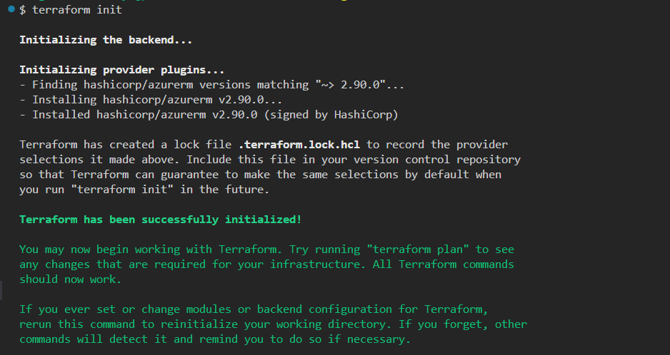
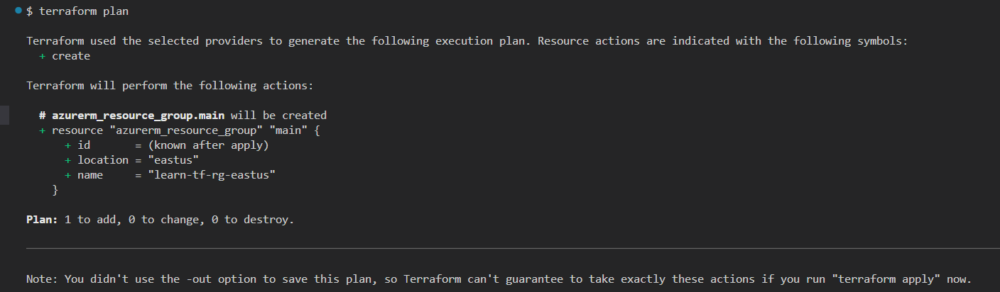
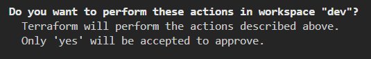

note: we can manage envoronment by creating configurations in different folders
instead of 'workspaces'

### 1. Authenticate to Azure with service principal (using cloud

shell/portal/bash)
https://learn.microsoft.com/en-us/azure/developer/terraform/authenticate-to-azure-with-service-principle?tabs=bash

### 2. Main terraform commands `terraform init` prepairs working directory for

other commands `terraform validate` checks whethere the configuration is valid

`terraform plan` shows all the changes will taking place with current
configuration. we can see what's going to happen when we apply terraform config

`terraform apply`

`terraform destroy` destroys previously-created infrastructure

type `terraform` and see all the commands

### 3. Common commands to managed

workspaces within the terraform terminal (terraform cli workspaces)

Terraform Workspaces are a way to create separate instances of state data within
the same working directory. Sort of - the way to separate envornments within
same directory.

Terraform Cloud Workspaces create separate workign directory while with the
terraform CLI workspaces we are workign with teh same directory but its creating
separate files.

`terraform workspace show`

`terraform workspaces list`

`terraform workspace select <name>`

`terraform workspaces new dev` - create new terraform worspace for development
environment

### 4. Terraform State

The state file maps real world resources to our configuration, keeps track of
metadata, and improves performance ofr large infrustructures.

tfstate file are in json. we shold not edit the file manually

By default, state fiels are stored locally as `terraform.tfstate` we can store
it remotely in terrafor mcloud or cloud storage accounts

State files refreshes to udate the state with the real infra to make sure the
things already match up

for example if we have reasource blocks that are already associated to
infrastructure in the state file and already exist in azure portal, if we update
the resources in azure portal and since its no longer matches teh state file -
what it will do is to ask to import that resource so it is up-to date with your
real infra.

Thta's why its important that the state file and azur eresources do match, otehr
wise it can cause issues to a state file.

### 5. terraform resource blocks

key foundation of terraform. They describe one of more infra objects: VM, VNETS
etc.

While writgin the configuration in config files the resources are not created
until we run command `terraform apply`. When eventyually the real infra
created - the objets are updated in the state file. This allows to updated
/detroy infra in the next iterations for the resource blocks that have already
have an associated object - it will compare stete file to make sure it is
matches and will make any updates to the object if nessesary.

resoure block dreclare resource of a given type and allows to define the params
of the resource: the nae location, sv, etc ,sku, operatgin system.

### 6. terraform providers

Terraform relies on "providers" to interact with cloud providers or otehr api.
Without providers we can not create any reasource. We need to declare terraform
provider to even get started with terraform.

Most providers configure specific types of objects, such as :

- infra
- naming conventions
- generating random numbers

Just to help implement and simplify the infra and configurations.

docs for azure provider
https://registry.terraform.io/providers/hashicorp/azurerm/latest/docs

```
terraform {
  required_providers {
	azurerm = {
	  source  = "hashicorp/azurerm"
	  version = "~> 2.90.0"
	}
  }
}
```

after the configured the provider - we need to install the provide to make sure
we can utilize in our environment.

`terraform init` it will take a look at providers and make sure it is installed
and added to our state file.



### 7. Declare first resource group

```
resource "azurerm_resource_group" "main" {
  name = "learn-tf-rg-eastus"
  location = "eastus"
}
```

Now that we have our first config blck created, we can open the terminal up, mke
sure we are authenticated.

`terraform plan` - and see which resources will be created. if no changes - make
sure the the config file is saved.

Give it a second while it is running plan as it is trying to match up with your
resource block with the state file.



These are the changes that will be applied once we run `terraform apply`.

`terrafor apply`



it will prompt to confirm if we want terraform to perform the actions.

make sure to keep terraform state file safe as it contans sensitive information.

WALK THROUGH - RESOURCES CREATION

Azure VNETS allow resources talk to each other

NICs will be attached to VNETS and vnics allow VMs talk to each other or
communicate with different resources witin azure env. vnics are connected to
subnets vithin Vnets. They can connect with other vnics within virtual networks
or subnets without any configuration.

for the purposes of the demo VNIC will be created without public interface - VMs
would not be publicly accessed over the internet. so htis will be within virtual
network and subnet just created. vnics add additional layer of security since it
would not be able to communicate over the internet.

materials are based on linkedin learning course
https://www.linkedin.com/learning/introduction-to-terraform-on-azure
